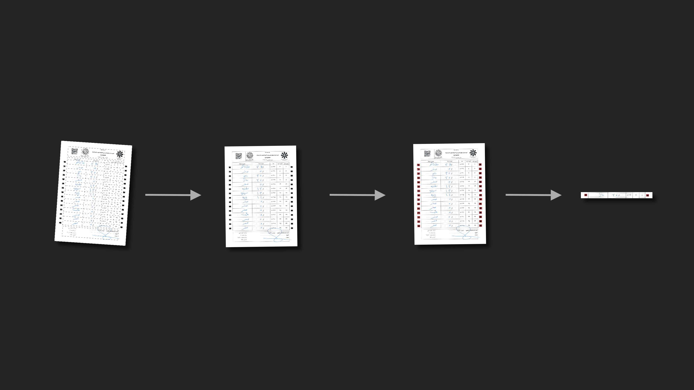
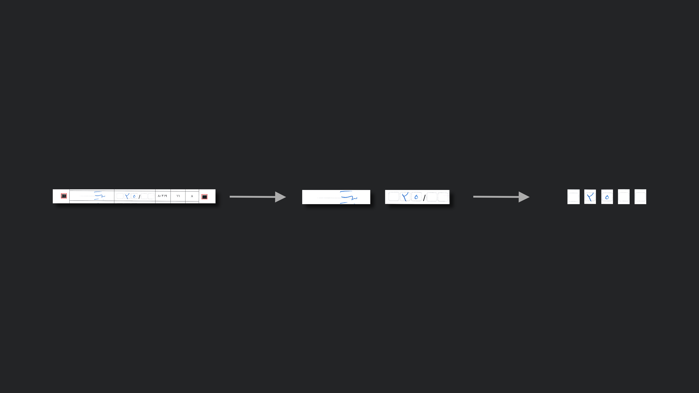

# Form Character Recognizer


 

Simple Script for Extracting and **Recognizing** handwriten or written numbers from given form.

## Quick Start

### Prerequisite

- python 3+
- opencv
- numpy

### Usage

Make a directory called `Forms` where the script lives on your computer, copy forms into that, and run the script like so:

```shell
python3 generate_dataset.py
```

## Details

After Reading a form image, as forms may be rotated duo to scanning process, images get horizontal by detecting and calculating images rotated angle using `warpAffine` function. after that, black boxes (eyes) on the sides of the page representing a row are detected using `findContours` function. to ensure that found boxes are the one we want, after appling a blur filter, closing operation, and a threshold, their area are examined to match a known range.

 

After detecting rows by sorting found contours, cause the distance between cells are certain, handwritten numbers' cell and numbers written in letters' cell and just the same, box of each number is found. 

 
