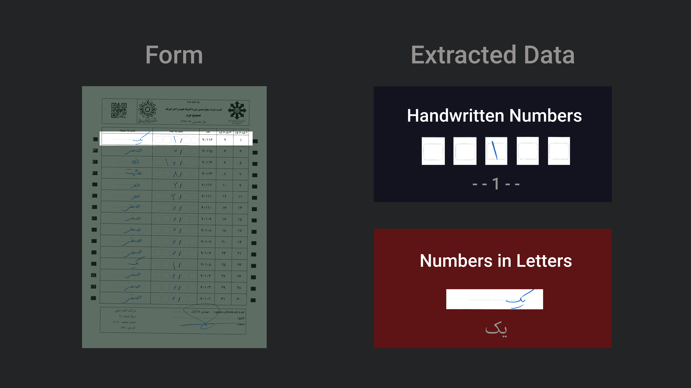

# Form Character Recognizer



  

Simple Script for Extracting and **Recognizing** handwriten or written numbers from given form.

## Prerequisite

- python 3+
- opencv
- numpy

## Usage

Make a directory called `Forms` where the script lives on your computer, copy forms into that, and run the script like so:

```shell
python3 generate_dataset.py
```